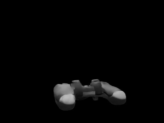
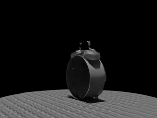
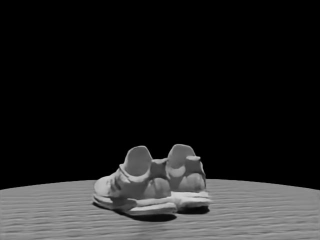

# EvHGen: Event-based Hierarchical Gaussian Primitives Generation Framework
Code will be released

## Demonstration 
<table>

<tr>
  <td colspan="4" style="text-align:center;">
    

    

      Surround trajectory
    

  </td>
</tr>
  <tr>
    <td align="center"></td>
    <td align="center"></td>
    <td align="center"></td>
  </tr>

  <tr>
    <td align="center"></td>
    <td align="center"></td>
    <td align="center"></td>
  </tr>

<tr>
  <td colspan="4" style="text-align:center;">
    

    

      Other trajectory
    

  </td>
</tr>

  <tr>
    <td align="center"></td>
    <td align="center"></td>
    <td align="center"></td>
  </tr>

  <tr>
    <td align="center"></td>
    <td align="center"></td>
    <td align="center"></td>
  </tr>

</table>
